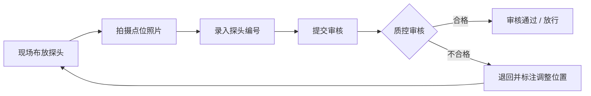

## 1. 产品概述

冷链多点探头布控 Web 控制台是面向冷链运营中心的专业管理平台，服务于调度主管与质控专员。平台核心价值在于将每条运输任务的探头布控方案提前标准化、可视化，而非简单的实时数据大屏展示。通过模板化管理、审核流程闭环和异常复盘机制，持续优化探头布点策略，保障冷链运输品质。

## 2. 核心功能

### 2.1 用户角色

| 角色 | 核心职责 | 主要使用模块 |
|------|----------|--------------|
| 调度主管 | 创建线路模板、派发运输任务、套用布控方案 | 线路模板管理、任务总览 |
| 质控专员 | 审核布控质量、标记异常节点、复盘优化方案 | 布控审核、异常复盘 |

### 2.2 功能模块

1. **线路模板管理**：按干线、城配、医药专线等分类创建模板，配置车厢尺寸、温区划分、货品敏感等级和必放点位，派车时直接套用。
2. **布控审核**：现场提交点位照片与探头编号后，质控专员在审核页查看车厢平面图、照片证据、设备状态和缺失项，确认无误放行；不合格可退回并标注调整位置。
3. **异常复盘**：到货后按任务查看各点位温度曲线，标记开门、换车、卸货等关键节点，评估探头布点合理性，反哺模板优化。

### 2.3 页面详情

| 页面名称 | 模块名称 | 功能描述 |
|---------|---------|---------|
| 控制台首页 | 数据概览 | 任务统计、审核待办、异常告警、模板使用率 |
| 线路模板管理 | 模板列表 | 模板分类筛选、搜索、启用/停用、复制模板 |
| 线路模板管理 | 模板详情/编辑 | 车厢尺寸配置、温区划分、点位布局、敏感等级设置 |
| 布控审核 | 待审核列表 | 任务卡片、审核状态、现场提交时间、快速操作 |
| 布控审核 | 审核详情页 | 车厢平面图、点位照片、设备状态、缺失项检查、审核操作 |
| 异常复盘 | 任务列表 | 已完成任务、异常标记数、复盘状态筛选 |
| 异常复盘 | 复盘详情页 | 多探头温度曲线对比、事件节点标记、布点评估、优化建议 |

## 3. 核心流程

### 3.1 模板创建与套用流程

调度主管创建线路模板，配置车厢参数与点位要求；模板经质控专员确认后生效；派车时调度主管选择对应模板，自动生成布控任务单下发至现场。

### 3.2 布控审核流程

现场人员按模板布放探头，拍摄点位照片并录入探头编号后提交；质控专员在审核页对照平面图检查点位完整性、照片清晰度、设备在线状态；合格则放行，不合格则退回并标注调整位置，现场整改后重新提交。

### 3.3 异常复盘流程

运输任务完成后，系统汇集各探头温度数据；质控专员查看温度曲线，标记开门、换车、卸货等事件节点；评估各点位数据有效性，判断布点是否合理；将复盘结论沉淀为模板优化建议。

## 4. 用户界面设计

### 4.1 设计风格

- **主色调**：深海蓝（#0F2A4A）搭配冰蓝色（#00D4FF）点缀，体现冷链专业感与科技感
- **辅助色**：预警橙（#FF8A3D）、合格绿（#2DD4A0）、告警红（#FF5757）
- **背景**：深色渐变底（#0A1628 → #112240），搭配细微网格纹理，营造工业控制台氛围
- **字体**：标题使用 Space Grotesk 粗体，正文使用 Inter，数字使用等宽字体 JetBrains Mono
- **卡片风格**：半透明玻璃拟态（Glassmorphism），带微妙边框和柔和投影
- **按钮风格**：圆角 8px，主按钮带渐变和微悬停上浮效果
- **图标风格**：线性细描边图标，统一 2px 线宽

### 4.2 页面设计概览

| 页面名称 | 模块名称 | UI 元素 |
|---------|---------|---------|
| 控制台首页 | 数据概览 | 顶部导航栏、侧边菜单、四个统计卡片（任务数/待审核/异常数/模板数）、待办列表、趋势折线图 |
| 线路模板管理 | 模板列表 | 分类标签页、搜索栏、模板卡片网格、卡片含缩略图、标签、状态、操作按钮 |
| 线路模板管理 | 模板编辑 | 左右分栏布局，左侧车厢平面图编辑器，右侧参数配置表单 |
| 布控审核 | 审核详情 | 三栏布局：左侧任务信息、中间车厢平面图与点位标记、右侧照片与设备状态、底部审核操作栏 |
| 异常复盘 | 复盘详情 | 顶部任务信息、中部温度曲线图表（支持多线叠加）、底部事件时间轴、右侧布点评估面板 |

### 4.3 响应式

- 桌面端优先设计，最小支持 1280px 宽度
- 主内容区采用弹性布局，卡片网格自适应
- 侧边栏可折叠以适配中等屏幕
- 表格区域支持横向滚动

### 4.4 数据可视化特色

- **车厢平面图**：SVG 可交互平面图，支持点击添加/拖动点位，温区用不同透明度色块区分
- **温度曲线**：使用平滑贝塞尔曲线，多探头用不同颜色区分，支持悬浮显示数值
- **事件标记**：在温度曲线上用竖线+图标标记开门、换车、卸货等事件
- **状态指示器**：设备在线/离线/异常用不同颜色的呼吸灯效果表示
