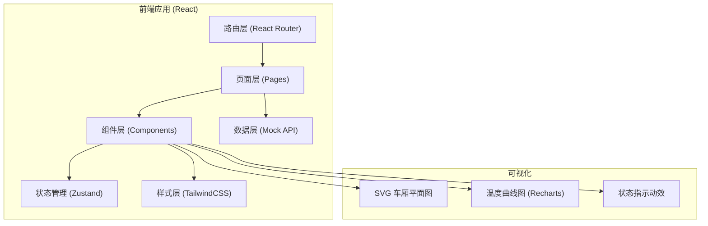
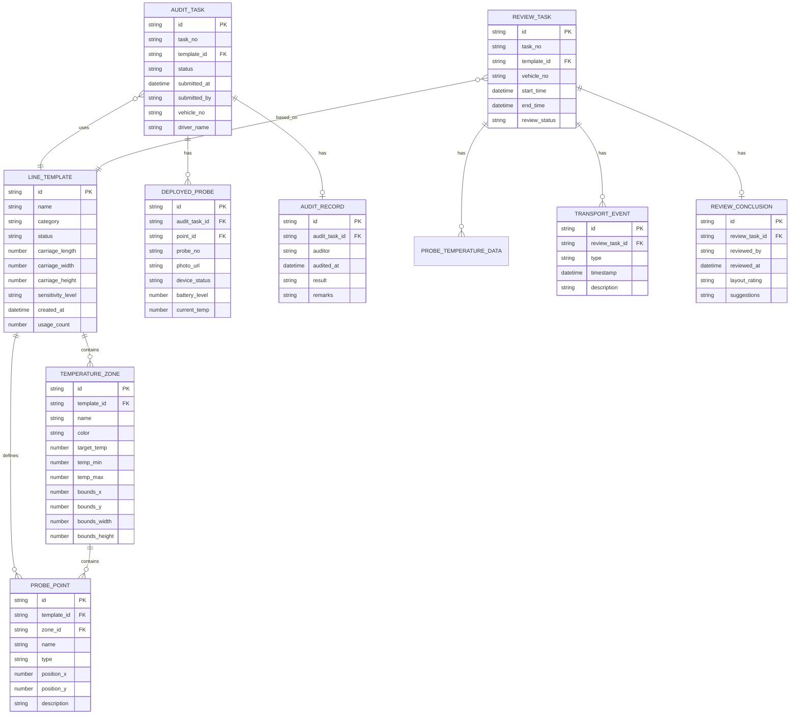

## 1. 架构设计



## 2. 技术描述

- **前端框架**：React 18 + TypeScript
- **构建工具**：Vite 5
- **样式方案**：TailwindCSS 3 + CSS Variables
- **路由管理**：React Router v6
- **状态管理**：Zustand（轻量级状态管理）
- **图表库**：Recharts（温度曲线、统计图表）
- **图标库**：Lucide React（线性图标）
- **数据方案**：Mock 数据 + localStorage 持久化模拟

## 3. 路由定义

| 路由 | 页面名称 | 功能说明 |
|------|---------|---------|
| / | 控制台首页 | 数据概览、统计卡片、待办事项 |
| /templates | 线路模板列表 | 模板分类、搜索、列表展示 |
| /templates/new | 新建模板 | 模板创建表单、车厢平面图编辑器 |
| /templates/:id | 模板详情/编辑 | 查看和编辑已有模板 |
| /audits | 布控审核列表 | 待审核任务、已审核任务 |
| /audits/:id | 布控审核详情 | 审核操作、照片查看、点位检查 |
| /reviews | 异常复盘列表 | 已完成任务、复盘状态 |
| /reviews/:id | 异常复盘详情 | 温度曲线、事件标记、布点评估 |

## 4. 类型定义

```typescript
// 线路模板
interface LineTemplate {
  id: string;
  name: string;
  category: 'trunk' | 'city' | 'pharmacy' | 'custom';
  categoryName: string;
  status: 'active' | 'inactive';
  description: string;
  
  // 车厢参数
  carriage: {
    length: number; // 米
    width: number;
    height: number;
    volume: number; // 立方米
  };
  
  // 温区
  zones: TemperatureZone[];
  
  // 点位
  points: ProbePoint[];
  
  // 货品敏感等级
  sensitivityLevel: 'normal' | 'sensitive' | 'highly-sensitive';
  
  createdAt: string;
  updatedAt: string;
  usageCount: number;
}

// 温区
interface TemperatureZone {
  id: string;
  name: string;
  color: string;
  targetTemp: number;
  tempRange: { min: number; max: number };
  bounds: { x: number; y: number; width: number; height: number };
}

// 探点位置
interface ProbePoint {
  id: string;
  name: string;
  type: 'mandatory' | 'optional';
  x: number; // 相对位置百分比 0-100
  y: number;
  zoneId?: string;
  description: string;
}

// 布控审核任务
interface AuditTask {
  id: string;
  taskNo: string;
  templateId: string;
  templateName: string;
  status: 'pending' | 'approved' | 'rejected' | 'resubmitted';
  submittedAt: string;
  submittedBy: string;
  vehicleNo: string;
  driverName: string;
  
  // 实际布放的探头
  deployedProbes: DeployedProbe[];
  
  // 缺失项
  missingPoints: string[];
  
  // 审核记录
  auditRecord?: AuditRecord;
}

// 已布放探头
interface DeployedProbe {
  id: string;
  pointId: string;
  probeNo: string;
  photoUrl: string;
  deviceStatus: 'online' | 'offline' | 'abnormal';
  batteryLevel: number;
  currentTemp: number;
}

// 审核记录
interface AuditRecord {
  auditor: string;
  auditedAt: string;
  result: 'approved' | 'rejected';
  remarks: string;
  adjustmentMarks?: AdjustmentMark[];
}

// 调整标记
interface AdjustmentMark {
  id: string;
  pointId: string;
  x: number;
  y: number;
  description: string;
}

// 复盘任务
interface ReviewTask {
  id: string;
  taskNo: string;
  templateId: string;
  templateName: string;
  vehicleNo: string;
  startTime: string;
  endTime: string;
  reviewStatus: 'pending' | 'reviewed';
  
  // 各探头温度数据
  probeData: ProbeTemperatureData[];
  
  // 事件节点
  events: TransportEvent[];
  
  // 复盘结论
  reviewConclusion?: ReviewConclusion;
}

// 探头温度数据
interface ProbeTemperatureData {
  probeId: string;
  probeNo: string;
  pointName: string;
  timestamps: string[];
  temperatures: number[];
}

// 运输事件
interface TransportEvent {
  id: string;
  type: 'door-open' | 'transfer' | 'unload' | 'other';
  typeName: string;
  timestamp: string;
  description: string;
}

// 复盘结论
interface ReviewConclusion {
  reviewedBy: string;
  reviewedAt: string;
  layoutRating: 'good' | 'fair' | 'poor';
  optimizationSuggestions: string;
  effectivePoints: string[];
  blindSpots: string[];
}
```

## 5. 数据模型



## 6. 目录结构

```
src/
├── assets/             # 静态资源
├── components/         # 通用组件
│   ├── layout/         # 布局组件（侧边栏、顶栏）
│   ├── ui/             # 基础UI组件（按钮、卡片、模态框）
│   └── charts/         # 图表组件
├── pages/              # 页面组件
│   ├── dashboard/      # 控制台首页
│   ├── templates/      # 线路模板管理
│   ├── audits/         # 布控审核
│   └── reviews/        # 异常复盘
├── store/              # 状态管理
├── types/              # TypeScript 类型定义
├── mock/               # Mock 数据
├── utils/              # 工具函数
├── App.tsx
├── main.tsx
└── index.css
```

## 7. Mock 数据说明

项目使用 Mock 数据模拟后端，包含：
- 6 个线路模板（干线、城配、医药专线各 2 个）
- 8 个布控审核任务（覆盖不同审核状态）
- 6 个复盘任务（含完整温度曲线和事件数据）
- 所有数据通过 Zustand store 管理，支持 localStorage 持久化
